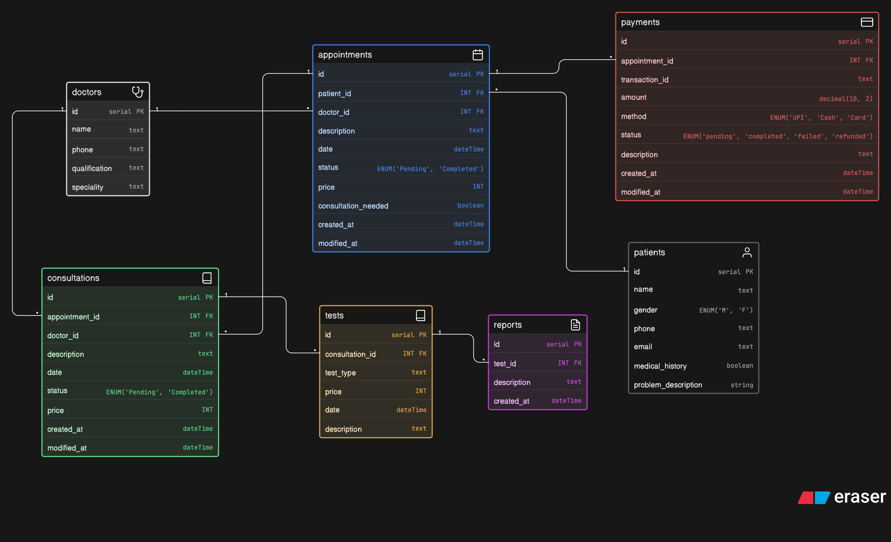

# 🏥 Clinic Appointment and Diagnostics Platform – ERD

## 📌 Overview

A relational database design for a clinic system that manages doctors, patients, appointments, consultations, diagnostic tests, reports, and payments.

The system supports appointment booking, consultation tracking, test prescriptions, report generation, and payment handling in a structured and scalable way.

## 🧱 Core Tables

* **Doctors** → doctor details and qualifications
* **Patients** → patient personal information
* **Appointments** → booking records between patients and doctors
* **Consultations** → actual visits linked to appointments
* **TestTypes** → standardized diagnostic test catalog
* **Tests** → tests prescribed during consultations
* **Reports** → diagnostic reports generated for tests
* **Payments** → transaction records for appointments

## 🔗 Relationships

* Patient → Appointments (1:N)
* Doctor → Appointments (1:N)
* Appointment → Consultations (1:N)
* Doctor → Consultations (1:N)
* Consultation → Tests (1:N)
* Tests → Reports (1:N)
* Appointment → Payments (1:N)

## ⚙️ Key Features

* Supports multiple visits for each patient
* Tracks complete flow from appointment → consultation → diagnostics → reports
* Allows multiple tests per consultation
* Supports multiple reports per test (for revisions or updates)
* Clean separation of test types and test instances
* Payment tracking linked to appointments for better traceability
* Normalized schema to avoid redundancy and ensure data consistency
