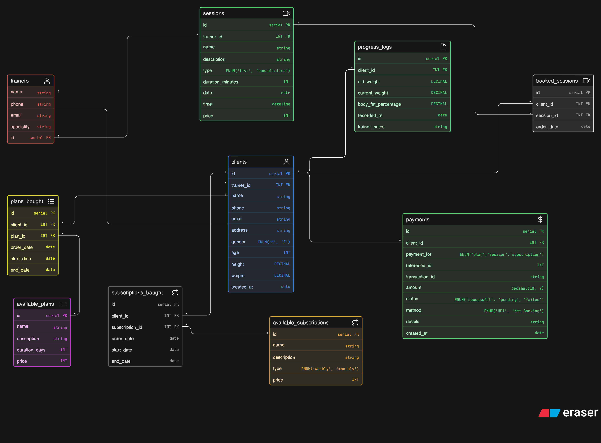

# 🏋️ Fitness Influencer Coaching Platform – ERD

## 📌 Overview

A relational database design for an online fitness coaching platform where trainers manage clients, offer plans, conduct sessions, and track progress.

The system supports plan purchases, session bookings, subscriptions, payments, and client progress tracking.

## 🧱 Core Tables

* **Trainers** → coach details  
* **Clients** → user details linked to trainers  
* **AvailablePlans** → coaching plans offered  
* **Sessions** → live sessions & consultations  
* **AvailableSubscriptions** → recurring subscription options  
* **PlansBought** → plan purchases by clients  
* **BookedSessions** → session bookings  
* **SubscriptionsBought** → subscription records  
* **ProgressLogs** → client progress tracking  
* **Payments** → transaction records  

## 🔗 Relationships

* Trainer → Clients (1:N)  
* Trainer → Sessions (1:N)  
* Client → PlansBought (1:N)  
* Client → BookedSessions (1:N)  
* Client → SubscriptionsBought (1:N)  
* Client → ProgressLogs (1:N)  
* Plans → PlansBought (1:N)  
* Sessions → BookedSessions (1:N)  
* Subscriptions → SubscriptionsBought (1:N)  

## ⚙️ Key Features

* Supports multiple plans and subscriptions per client  
* Tracks session bookings and consultations  
* Maintains detailed client progress logs  
* Flexible payment system using polymorphic reference  
* Clean separation of users, plans, sessions, and progress  
